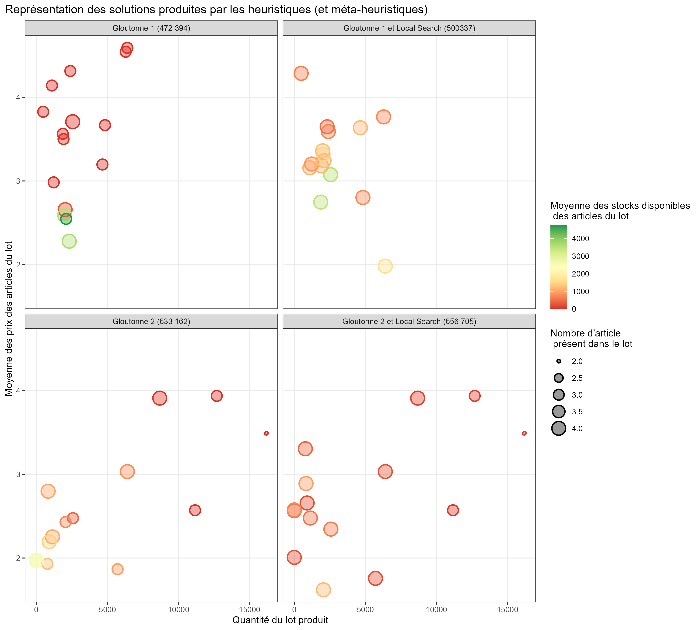
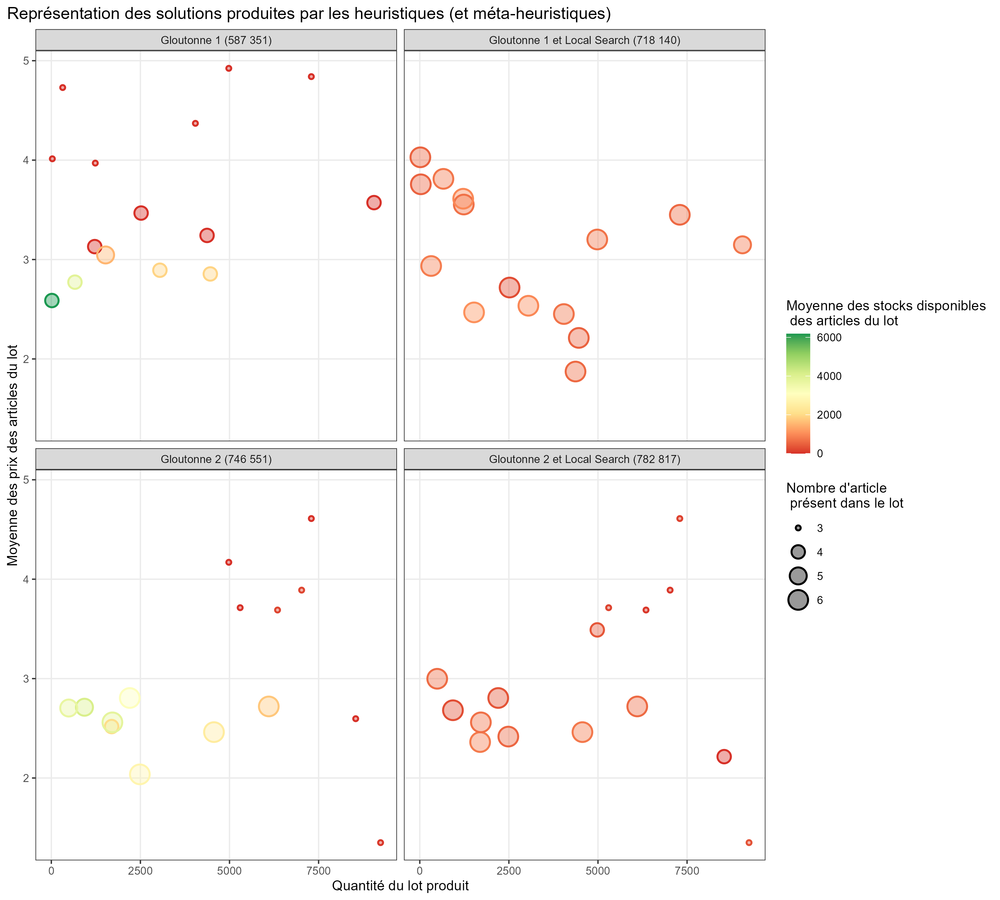
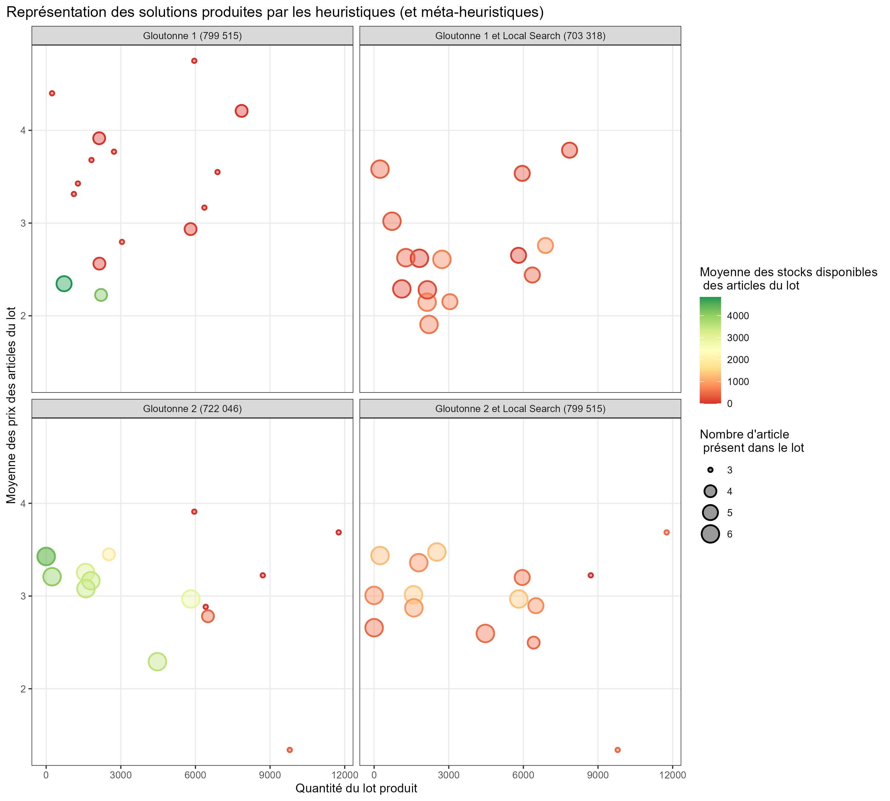

# :tshirt: Optimisation-profit-net :shirt:

## Problème

La partie principale de ce problème consiste à la composition des lots   
$$x_{ij}=nombre\ d^\prime article\ i\ dans\ le\ type\ j\ de\ lot$$ 

Puis l’affectation de ces lots au conditionnement
$$z_{ijk}=nombre\ de\ conditionnement\ de\ l^\prime article\ i\ pour\ le\ lot\ de\ type\ j\ sur\ le\ poste\ k$$

**Fonction objective**  
$$\left[VS\right]∶\ max\ \sum_{j}\sum_{i}\sum_{k}{\left(p_i-\ c_d\right)z}_{ijk}$$

## Contraintes

Articles distincts dans un lot
$$\forall j\in J,\ \forall i\ \in I,\ x_{ij}\le1$$

Respect du nombre d’article disponible
$$\forall i\ \in I,\ \sum_{k}\sum_{j} z_{ijk}\le\ Q_i$$

Nombre de lots maximum
$$\sum_{j\in J}{y_j\le\ L_{max}}$$

Minimum d’indice commercial par lot
$$\forall j\ \in J,\sum_{i}{x_{ij}w_i\geq r_{min}}$$

Lot conditionné en entier 
$$\forall j\ \in J,\ \forall k\ \in K,\ \forall\left(i,i^\prime\right),\ z_{ijk\ }=\ z_{i\prime j k\ }$$

Respect des capacités machines et lien variables $z_{ijk\ }$ et $y_j$
$$\forall k\ \in K,\sum_{j}\sum_{i}{z_{ijk\ }\le\ C_ky_j}$$

Contrainte couplante
$$\forall j\ \in J,\ \sum_{i}{x_{ij}\geq\ y_j}$$

## Representation graphique des solutions sur les 3 instances

### Instance 1

***

### Instance 2

***

### Instance 3

***

On remarque que si la gloutonne naïve obtient de moins bon résultat c’est qu’elle favorise trop les lots excessivement rentables avec des articles en très peu de quantité, elle arrive rapidement à saturation du nombre de lot maximum donc. Cette stratégie est cependant fonctionnelle sur l’instance 3.
